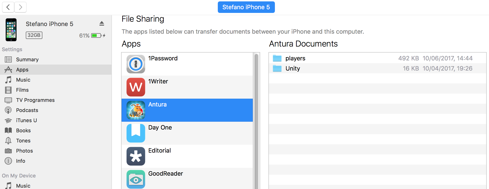

# How to retrieve the player database
 
The player Profile Database is saved as a SQLite database and can be easily retrieved and shared.

## Android

Go to the Folder:
`\storage\emulated\0\Android\data\org.eduapp4syria.antura\files\players`
 
You will find 1 to 5 files names like:
`Antura_Player_5b8e61c3-f990-43f5-a43f-e7cbf9556f17.sqlite3`

**5b8e61c3-f990-43f5-a43f-e7cbf9556f17** being the UID of the profile/player 
_NOTE: the number of files depends of the number of profiles that have been created on the phone_
 
COPY ALL THE FILES YOU FIND!  
The simplest way to copy the files is by connecting the Android phone to a PC, but you could also send them via Bluetooth (or in another way directly from the phone).

## iOS

Attach the iOS device to a computer via USB and open iTunes. Go to your device -> Apps -> File Sharing panel and select Antura. Drag the `players` folder onto your Desktop and the files are all there.

## Windows

Check folder `C:\Users\<username>\AppData\LocalLow\CGL_VGWB_Wixel\Antura\players\`
## Browse the SQLite Database

The Database can then be opened with any SQLite Viewer, like the following one (online): <http://inloop.github.io/sqlite-viewer/>  
You just drag and drop the file and you browse it!

## Recover the player ID (UUID)

To recover the player ID, you have to
1. Go in the parent section (yellow button top right of the home screen)
2. Pass the parent code test (that ask you to press in a certain order colored buttons)
3. Then in the parent section you select the profile icon of the player
4. And the ID appears just under the icon
