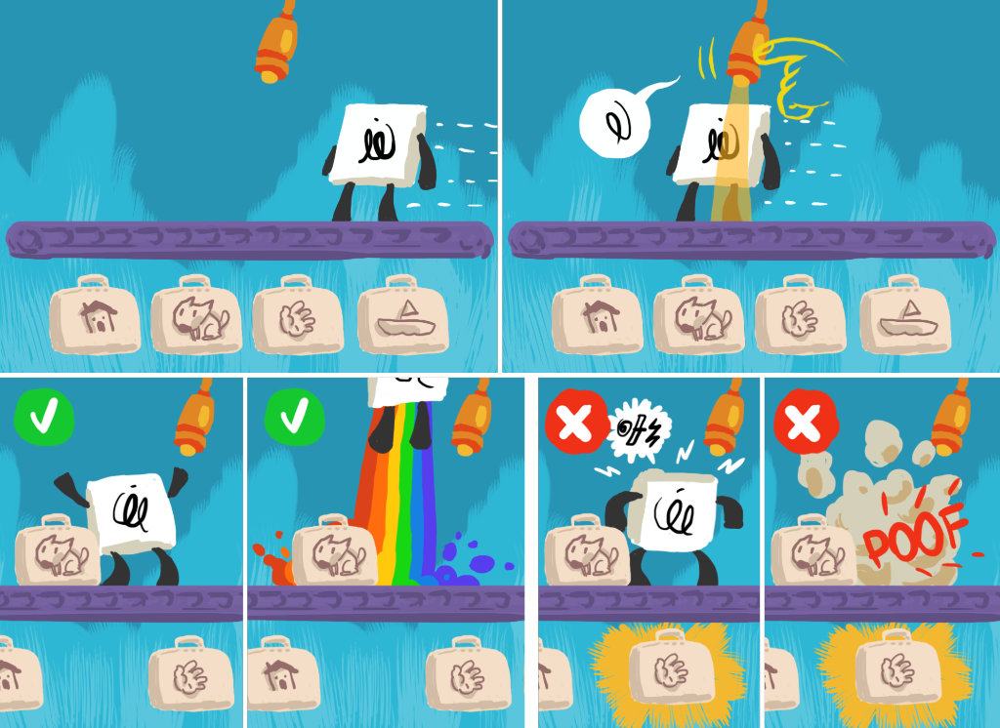

# MiniGame: Scanner

## Testing procedure
Total tests: 2
- Variations
    1. Scanner
	2. Scanner_phrase
- Difficulty Levels: ininfluent

### Shared Difficulty
- Belt speed increases with difficulty
- Living letters face away from the camera at higher difficulties

### Shortcuts
_none_

## Variations
### 1. Scanner
Player must find the correct letter.

#### Difficulty
Ignored

#### Scoring
- 3 stars if...
- 2 stars if...
- 1 star if...
---
### 2. Scanner_phrase
Player must find the correct word.

#### Difficulty
Time to answer decreases with difficulty.

#### Scoring
- 3 stars if...
- 2 stars if...
- 1 star if...
---
## Developer notes

## Issues

## Warnings to be fixed

## Optimization

---

## Game Design Docs

### Objectives

**Pedagogical**: Reading training, word image association.

**Play**: Find and give the right luggage to the LL.

### Mechanics

**Time-based, with multiple LLs/challenges**.

In the middle of the screen we have a conveyor belt moving left to right, over which an LL (with a word) is standing idle while being transported (the idea is that she's passing the checkpoint to fly somewhere, and we need to give her back her correct luggage).

- On the top of the screen, there's a scanner device, which the player can drag (along the whole width of the screen). When dragged/kept-pressed, the scanner emits a light (fun light) which, when passing over the LL, makes the game utter the LL's word at the speed we're dragging the scanner (using dynamic audio pitch controls). **NOTE**: when the player doesn't interact with the scanner, it's off and doesn't do anything.
- On the bottom, we have a series of suitcases, each with a drawing. The player will have to drag/give the correct suitcase to the LL (based on word-image association). If the wrong suitcase is given, the LL goes away angry and the timer loses some seconds.
- After a suitcase is given, the LL will go away (with a happy or angry animation depending on the outcome). A new LL and a new set of suitcases will appear (new round - same timer).

### Antura

Sometimes Antura jumps in from the right side and stays there jumping in position for a while (if an LL had already reached the right side, she's bumped and falls out - but no time is lost). After N seconds, he runs like a bull towards the opposite side and throws away all the LLs present (again, no time is lost, only LLs).

While Antura is jumping on place, the player can interact with the scanner and pass it repeatedly over him to scare him away, so he won't charge the LLs.

### Variation details:

- Random words (3-5) and we give them their respective 3-5 suitcases.
- Every set is based on a timer, if the kid doesn’t finish in time, we make the belt accelerate quickly and throw the LL in a funny way.
- Same 6 rounds per one game

### Difficulty variations
#### Gameplay
The conveyor belt moves faster.
#### Pedagogical

- Additional suitcases to choose from.
- Suitcases with similar words represented.
- In later levels, instead of having the scanner speak the LL's word, we could have LLs showing their back, and the scanner is simply used to make them turn _(the effect/animation could be as if we're tickling them with light, and they finally turn)_, without saying the word. This way the players have to use only visual word recognition instead of speech.

### Endround (repeated per round)

At each round completion a new set of suitcase and a new LL will appear. The timer will be the same for all rounds.

#### Success

The LL will grab the suitcase _(if technically feasible, otherwise the suitcase will just stay next to the LL)_, make a happy jump, and fly upwards (and off screen) followed by a rainbow trail.

#### Failure

**Condition**: timer elapses (endgame), wrong suitcase is given, or LL exits the screen.

The correct suitcase is immediately evidenced. The LL will utter her word (even if she is off-screen), and then, if she didn't exit already, disappears with a grumpy POOF (while uttering some disgruntled gibberish).

### Game variations
**Multiple words**
Each round has multiple words forming a sentence, where all suitcases are related to them and the player needs to combine all of them with the correct LL (which must all be visible). Failing one suitcase will jump to the next round (new set of LLs and suitcases).
